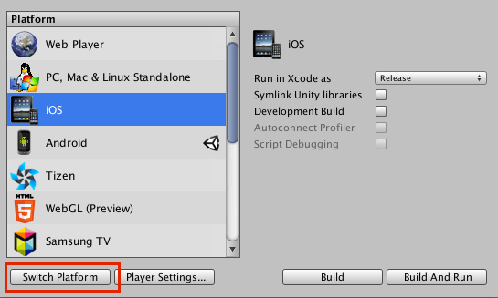
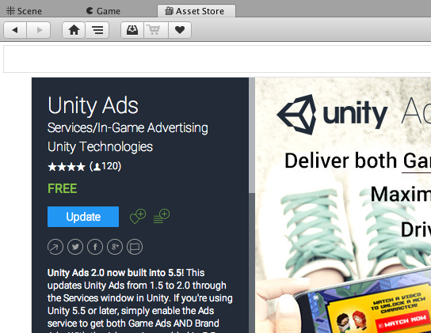
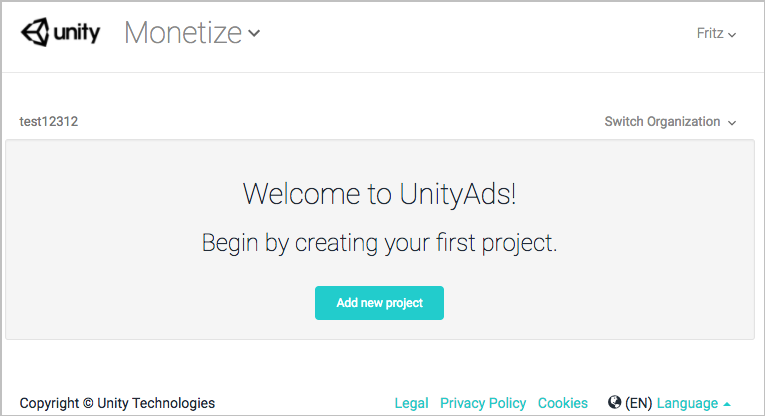
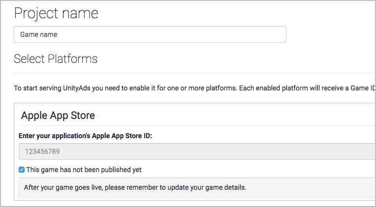
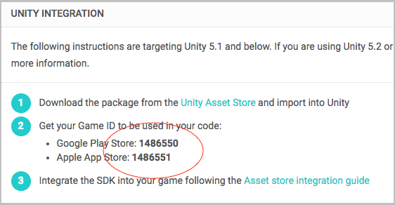

#### Welcome to Unity Ads!

Unity Ads can be enabled directly in **Unity 5.2 or later**.

Click here for Official Unity Ads documentation and additional integration paths:

- [Unity Ads Documentation](https://docs.unity3d.com/Manual/UnityAdsHowTo.html)
- [Unity Ads Knowledge Base](http://unityads.unity3d.com/help/monetization/getting-started)
- [Native iOS integration](http://unityads.unity3d.com/help/monetization/integration-guide-ios)
- [Native Android integration](http://unityads.unity3d.com/help/monetization/integration-guide-android)

# INTEGRATING UNITY ADS WITH THE ASSET PACKAGE

> Updated: July 20th, 2017

### Import the Unity Ads Asset Package

First, set the build targets and enable Unity Ads in the Services Panel.

1. Open your game project, or create a new Unity project.
2. Select **Edit > Build Settings**, and set the platform to iOS or Android.
3. Enable Ads in the Unity Services window.



Next, import the Unity Ads Asset Package into your project.



### Create a Game ID in the Unity Ads dashboard

Navigate to https://dashboard.unityads.unity3d.com and create a new game project.



Select iOS, Android, or both.



Locate the platform-specific GAME ID and save it for later.



### Add the code

1. First, declare the Unity Ads namespace in the header of your script:  
 	`using UnityEngine.Advertisements;`

2. Next, inititalize Unity ads
	`Advertisement.Initialize(string gameId)`
	
> Note: Unity Ads takes a few seconds to inititalize before videos can be shown

3. You can display an ad by calling the following method:  
	`Advertisement.Show(string placement)`

### Reward Players for Watching Ads

Rewarding players can add to user engagement, resulting in higher revenue!

Typically rewarded ad implementation generally involve one or more of the following: 

- In-game currency or consumables
- Extra lives at the start of the game
- Point boosts for the next round

You can reward players for completing a video ad using the **HandleShowResult** callback method in the example above. Be sure to check that the result is **ShowResult.Finished** to verify that the ad was not skipped before granting the reward.

```csharp
private void HandleShowResult (ShowResult result)
	if (result != ShowResult.Skipped)
	{
		//reward your player here!
	}
```

### Rewarded Ad Button Example Code

[The Unity Ads Scipting API can be found here](https://docs.unity3d.com/ScriptReference/Advertisements.Advertisement.html)

```csharp
using UnityEngine;
using UnityEngine.UI;

using UnityEngine.Advertisements;

public class UnityAdsButton : MonoBehaviour
{
	//Call this to show an ad with the "rewardedVideo" placement
	void ShowAd ()
	{
		var options = new ShowOptions();
		options.resultCallback = HandleShowResult;

		Advertisement.Show("rewardedVideo", options);
	}

	//HandleShowResult will be called when the ad stops playing
	void HandleShowResult (ShowResult result)
	{
		if(result == ShowResult.Finished){
			Debug.Log("Video completed - Offer a reward to the player");
			
		}else if(result == ShowResult.Skipped){
			Debug.LogWarning("Video was skipped - Do NOT reward the player");
			
		}else if(result == ShowResult.Failed){
			Debug.LogError("Video failed to show");
		}
	}
}
```
Then press the editor Play button to test the Unity Ads Button integration.

Additional examples and troubleshooting can be found in our [monetization documentation](http://unityads.unity3d.com/help/monetization/integration-guide-unity).
If you have any questions, please post them to the [Unity Ads forum](http://forum.unity3d.com/forums/unity-ads.67) or contact us at unityads-support@unity3d.com

### Manage Settings in the [Ads Dashboard](https://dashboard.unityads.unity3d.com/Dashboard)

Log into the [Unity Ads dashboard](https://dashboard.unityads.unity3d.com/Dashboard) using your UDN Account, and locate the project for your game.


Select a platform (iOS or Android).


From here, you can modify placements and other game-specific settings.


Additional information on placements can be found in our [placements Documentation](http://unityads.unity3d.com/help/monetization/placements).

For additional info, please see the [Unity Ads forum](http://forum.unity3d.com/forums/unity-ads.67), [Unity Ads Knowledge Base](http://unityads.unity3d.com/help/monetization/getting-started), [Unity Ads Documentation](https://docs.unity3d.com/Manual/UnityAdsHowTo.html), [Unity Support Knowledge Base](https://support.unity3d.com/hc/en-us/sections/201163835-Ads), or contact us directly at unityads-support@unity3d.com.


